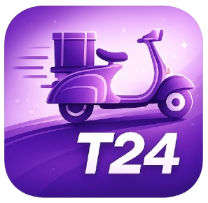
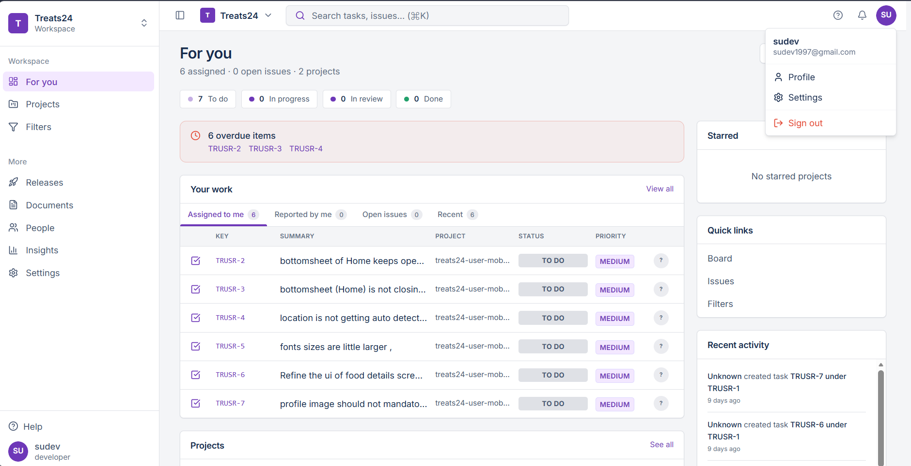
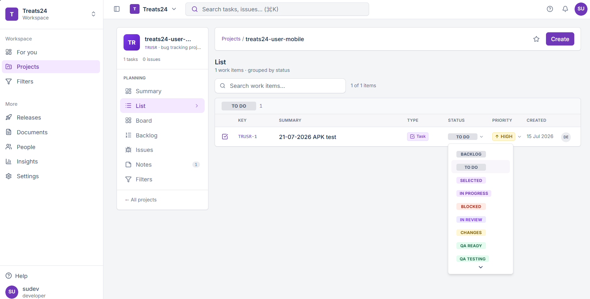
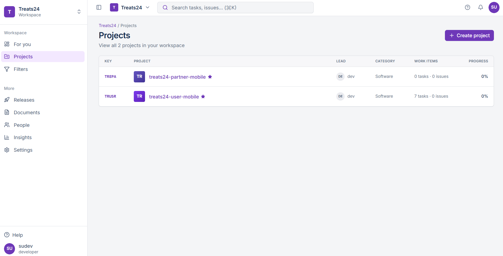
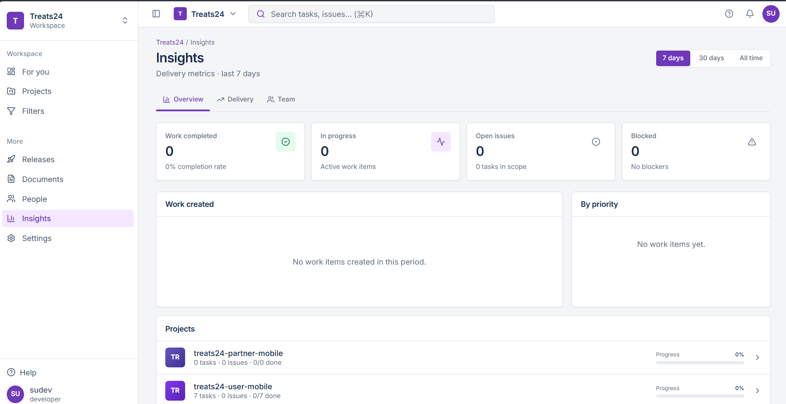

# 🍬 Treats24 Workspace

<div align="center">
  
</div>

**Internal Project Management & Issue Tracking Application**

A modern, full-featured project management front-end built with **React 19**, **TanStack Start**, and **Tailwind CSS v4**. Treats24 Workspace delivers a Jira-like experience for managing projects, tasks, issues, filters, team visibility, and delivery insights — all within a branded Treats24 interface.

---

## 📸 Screenshots

> *Screenshots showcasing the Treats24 Workspace application.*

| Dashboard (For You) | Project Dashboard |
|:---:|:---:|
|  |  |

| Projects Listing | Insights & Reports |
|:---:|:---:|
|  |  |

---

## ✨ Key Features

### 📊 Dashboard ("For You" — `/`)
- Personal work dashboard with assigned tasks, reported issues, and recent work items
- Status summary chips (To Do, In Progress, In Review, Done)
- Overdue items alert with quick links
- Tabbed "Your Work" panel (Assigned to me, Reported by me, Open issues, Recent)
- Project list preview with progress indicators & starred projects sidebar
- Recent activity feed

### 📁 Projects (`/projects`, `/projects/:projectId`)
- Project listing with key, name, lead, category, work item counts, and progress
- Create project dialog with detailed fields (name, key, description, template, priority, due date, tags, team)
- Template selection: Scrum, Kanban, Bug tracking, Documentation
- Project detail page with multiple views: **Summary**, **List**, **Board** (Kanban), **Backlog**, **Issues**, **Filters**
- Color-coded project avatars and progress tracking

### ✅ Work Items / Tasks (`/tasks`, `/tasks/:taskId`)
- Unified work items page combining tasks and issues
- **List view** with grouping by status, inline status changes
- **Kanban board view** with drag-friendly status dropdowns
- Toggle between List and Board views
- Create ticket dialog supporting: Task, Story, Feature, Bug, Improvement, Hotfix, Documentation, Sub-task
- Task detail with editable fields, status workflow, assignee, priority, labels, parent/child relationships, and navigation

### 🐛 Issues (`/issues`, `/issues/:issueId`)
- Dedicated issues list filtered to issue-type work items
- Issue type breakdown badges (Bug, Feature, Improvement, Hotfix, Documentation)
- Bug-specific fields: Steps to reproduce, Expected behavior, Actual behavior, Severity
- Same status workflow and nested item support as tasks

### 🔍 Filters & Saved Queries (`/queries`)
- JQL-style saved filters for tasks and issues
- Filter criteria: Entity type, project scope, status, priority, assignee, issue type, text search
- Live result preview with key, summary, project, and status
- Human-readable filter description

### 📈 Insights & Reports (`/reports`)
- Delivery metrics dashboard with time range selector (7 days, 30 days, All time)
- Three tabs: **Overview** (stat cards, work-created chart, priority breakdown), **Delivery** (status distribution, completion rate), **Team** (workload per member)
- Metrics: Work completed, in progress, open issues, blocked items, completion rate

### 👥 Team (`/team`)
- Team member directory with role, email, avatar, and per-member stats
- Invite people button (UI placeholder)

### 📦 Releases (`/releases`)
- Release version history with status cards (Planned, In Development, Testing, Released)
- Features and fixes lists per release

### 📄 Documents (`/documents`)
- Team knowledge base listing with categorized document cards
- Categories: Requirements, Meeting Notes, Design, Engineering

### 👤 Profile (`/profile`)
- User profile with avatar, role, email, timezone, personal stats
- Editable personal information form (name, email, job title, bio)
- Assigned work list, completion rate, and recent activity feed

### ⚙️ Settings (`/settings`)
- Workspace settings (name, URL slug)
- Notification preferences toggles (task assigned, comments, status changes)

### 🔎 Global Search & Navigation
- Command palette (`Cmd/Ctrl + K`) via GlobalSearch component
- Search across tasks, issues, and projects
- Collapsible sidebar with icon mode
- Top bar with workspace switcher, search, notifications, and profile dropdown
- Breadcrumb navigation & 404/error boundary pages

---

## 🛠 Technology Stack

| Category | Technology |
|----------|-----------|
| **Frontend** | React 19, TypeScript 5.8 |
| **Routing & SSR** | TanStack Router, TanStack Start, TanStack React Query |
| **Build & Dev** | Vite 8, Nitro, ESLint, Prettier |
| **Styling** | Tailwind CSS v4, shadcn/ui (Radix UI primitives), Lucide React |
| **Forms & Validation** | React Hook Form, Zod |
| **Charts** | Recharts |
| **UI Components** | Sonner (toasts), cmdk (command palette), date-fns, Embla Carousel |
| **Backend** | Supabase (PostgreSQL, Auth, Storage) |
| **Hosting** | Vercel |

---

## 🏗 Architecture

```
src/
├── routes/              # File-based pages (TanStack Router)
│   ├── __root.tsx       # App shell, providers, layout
│   ├── index.tsx        # Dashboard
│   ├── projects/        # Projects listing & detail
│   ├── tasks/           # Tasks listing & detail
│   ├── issues/          # Issues listing & detail
│   ├── queries.tsx      # Saved filters
│   ├── reports.tsx      # Insights & analytics
│   ├── team.tsx         # Team directory
│   ├── releases.tsx     # Release history
│   ├── documents.tsx    # Knowledge base
│   ├── settings.tsx     # Workspace settings
│   ├── profile.tsx      # User profile
│   └── login.tsx        # Authentication
├── components/          # Reusable UI and feature components
│   ├── ui/              # shadcn/ui base components
│   ├── jira/            # Jira-style layout components
│   ├── ticket/          # Ticket/work-item UI
│   ├── project/         # Project-specific components
│   ├── auth/            # Authentication components
│   └── profile/         # Profile components
├── lib/                 # Utilities, types, state management
│   ├── data.ts          # Type definitions, constants, helpers
│   ├── workspace-store.tsx  # React Context state management
│   ├── query-utils.ts   # Filter/query engine
│   ├── auth.tsx         # Authentication context
│   └── supabase.ts      # Supabase client
├── hooks/               # Custom React hooks
└── styles.css           # Global styles & design tokens
```

### State Management
All workspace data (projects, tasks, issues, queries, activity) is managed in-memory via React Context (`WorkspaceProvider`). Data starts empty on page load — users create content through the UI.

### Route Structure
File-based routing under `src/routes/` with auto-generated `routeTree.gen.ts`. Dynamic routes use `$param` convention (e.g., `projects/$projectId.tsx`).

---

## 🚀 Getting Started

### Prerequisites
- **Node.js** (compatible with Vite 8 / React 19)
- **npm** or **bun** (package manager)

### Installation

```bash
# Clone the repository
git clone https://github.com/treats24/workspace.git
cd treats24-workspace

# Install dependencies (choose one)
npm install
# or
bun install
```

### Development

```bash
# Start development server
npm run dev
```

The app will be available at `http://localhost:5173` (or the next available port).

### Build & Preview

```bash
# Production build
npm run build

# Preview production build
npm run preview

# Development-mode build
npm run build:dev
```

### Lint & Format

```bash
npm run lint    # Run ESLint
npm run format  # Format with Prettier
```

---

## 🗺 Routes Reference

| Route | Page |
|-------|------|
| `/` | Dashboard ("For You") |
| `/projects` | Project listing |
| `/projects/:projectId` | Project detail (Summary, List, Board, Backlog, Issues, Filters) |
| `/tasks` | Work items (List + Board) |
| `/tasks/:taskId` | Task detail |
| `/issues` | Issues listing |
| `/issues/:issueId` | Issue detail |
| `/queries` | Saved filters |
| `/releases` | Release history |
| `/documents` | Knowledge base |
| `/team` | Team directory |
| `/reports` | Insights / Analytics |
| `/settings` | Workspace & notification settings |
| `/profile` | User profile |
| `/login` | Authentication |

---

## 📊 Data Model

### Core Entities

| Entity | Description |
|--------|-------------|
| **Member** | User with id, name, role, avatar, email |
| **Project** | Project with key, name, template, status, priority, team members |
| **Task** | Work item with title, description, status, priority, assignee, labels, parent/child links |
| **Issue** | Bug/feature with type, severity, steps to reproduce, expected/actual behavior |
| **SavedQuery** | Filter with name, criteria (entity type, status, priority, assignee, etc.) |
| **Release** | Version with name, status, date, features, fixes |
| **Document** | Knowledge base article with title, category, author, excerpt |
| **ActivityItem** | Log entry tracking user actions |

### Task Status Workflow (13 statuses)

```
Backlog → To Do → Selected for Development → In Progress → Blocked
                                                        ↓
                                                     In Review
                                                        ↓
                                              Changes Requested
                                                        ↓
                                                  Ready for QA
                                                        ↓
                                                  QA Testing
                                                   /        \
                                           Failed QA    Ready for Release
                                                           /        \
                                                      Released      Done
```

---

## ⚠️ Current Limitations

- **No backend API / database** — all data is in-memory and resets on page refresh
- Releases & Documents pages have UI but no create/edit flows; data arrays are empty
- Notifications are static/empty — no real-time notification system
- Settings and profile forms are UI-only (not persisted)
- Team invite is a button placeholder
- Comments and attachments on tickets show counts but are not fully functional
- Single hardcoded user (Sudev) in the members list
- Help links in sidebar and top bar are non-functional placeholders

---

## 🎨 Design System

Treats24 Workspace uses a custom Jira-inspired design language with Treats24 branding:

| Token | Value |
|-------|-------|
| **Primary** | `#6A21B0` (Purple) |
| **Primary Glow** | `#8B3DCC` |
| **Accent / CTA** | `#FF7A45` (Coral) |
| **Success** | `#22C55E` |
| **Warning** | `#F59E0B` |
| **Danger** | `#EF4444` |
| **Background** | `#F5EEFD` (Pale Lavender) |
| **Cards** | `#FFFFFF` |
| **Fonts** | Inter, Poppins |

Features: Large rounded corners (24–32px), soft lavender workspace background, purple gradients, coral CTAs, status lozenges with color-coded labels.

---

## 🧪 Scripts Reference

| Command | Description |
|---------|-------------|
| `npm run dev` | Start development server |
| `npm run build` | Production build |
| `npm run build:dev` | Development-mode build |
| `npm run preview` | Preview production build |
| `npm run lint` | Run ESLint |
| `npm run format` | Format code with Prettier |

---

## 📁 Project Structure

```
treats24-workspace/
├── public/             # Static assets (icons, screenshots)
├── src/                # Application source code
│   ├── components/     # Reusable components
│   ├── hooks/          # Custom hooks
│   ├── lib/            # Utilities, types, state
│   ├── routes/         # File-based pages
│   └── styles.css      # Global styles
├── supabase/           # Supabase migrations & configuration
│   └── migrations/     # Database migration files
├── package.json        # Dependencies & scripts
├── vite.config.ts      # Vite configuration
├── tsconfig.json       # TypeScript configuration
├── components.json     # shadcn/ui configuration
└── tailwind.config.ts  # Tailwind CSS configuration
```

---

## 🤝 Contributing

1. Create a feature branch from `main`
2. Make your changes with clear commit messages
3. Run `npm run lint` and `npm run format`before committing
4. Open a pull request

---

## 📄 License

Internal — Treats24 Private Workspace

---

*Built with ❤️ by the Treats24 Team*

